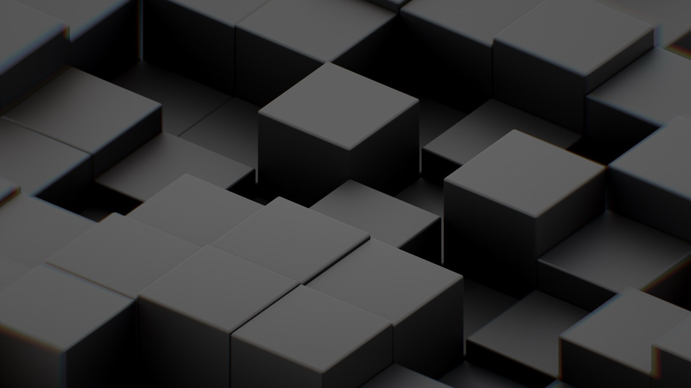

### Marlowe animated header

I've been working with Amrit and Richie to produce an animated background to the header of the new Marlowe website. The Marlowe branding is all about these cubes / building blocks, so the brief was to do something that looked cool but didn't pull too much focus from the actual website content.

I tried a bunch of different ideas with code, which consisted of a uniform grid of cubes that moved in a gentle sine wave. The code would apply a random phase of the sinewave to each cube to give it a sort of random feel.

I experimented with different materials and effects for the cubes. We quite liked the glossy materials but found it might steal focus from the text that would be sitting over it. 

After a few iterations, we decided that if we went down the route of making the animation with code then we would be a bit limited in terms of performance. In order to make it look awesome, we'd need to add in effects such as soft shadows, ambient occlusion and depth of field. While this is all very possible with code, it does add a significant performance overhead, which I thought was overkill for a non-interactive animation.

So I decided to use a 3D graphics package called Blender to simulate the animated cubes and render out a looping MP4 video that we could use as the header background.

Blender is awesome because you can be very specific in how your simulation looks with things like lighting, materials, and post-processing effects, and the rendering process actually simulates beams of light interacting with the materials to create a very realistic image. After a few rounds of iteration and fedback we settled on a matte material so eliminate any bright reflections.

<video src="dark.mp4" controls muted autoplay loop></video>

<video src="light.mp4" controls muted autoplay loop></video>

#### Here are some examples of some of the test-renders:

<video muted autoplay loop src="test-01.mp4"></video>

<video muted autoplay loop src="test-02.mp4"></video>

<video muted autoplay loop src="test-03.mp4"></video>

<video muted autoplay loop src="test-04.mp4"></video>

<video muted autoplay loop src="test-05.mp4"></video>

<video muted autoplay loop src="test-06.mp4"></video>

<video muted autoplay loop src="test-07.mp4"></video>

<video muted autoplay loop src="test-08.mp4"></video>

<video muted autoplay loop src="test-09.mp4"></video>

<video muted autoplay loop src="test-10.mp4"></video>

<video muted autoplay loop src="test-11.mp4"></video>

